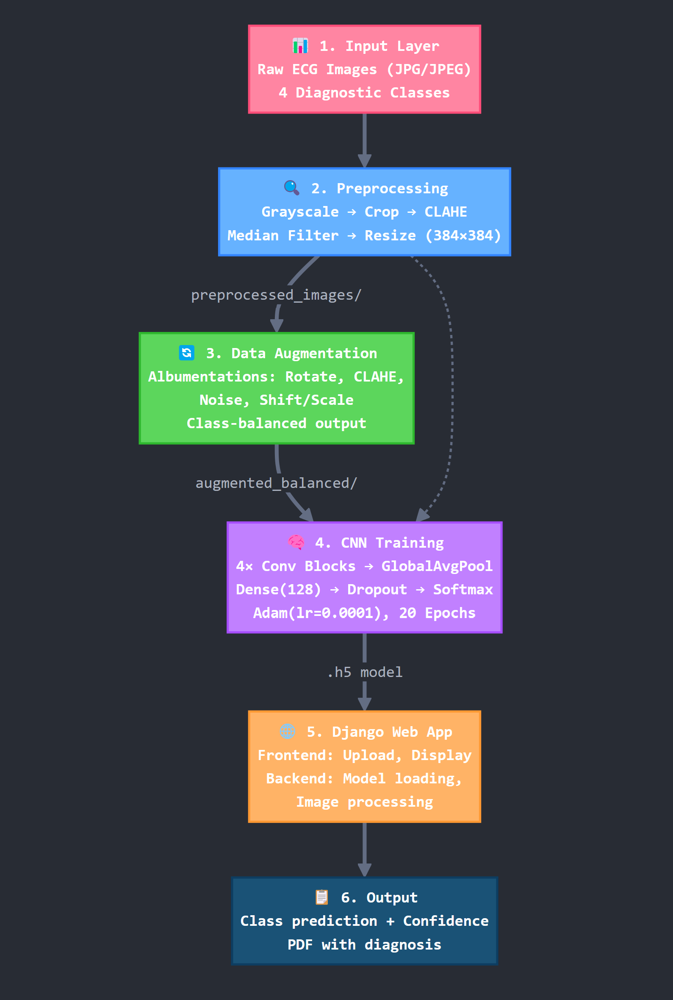
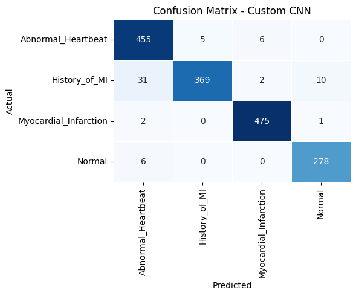
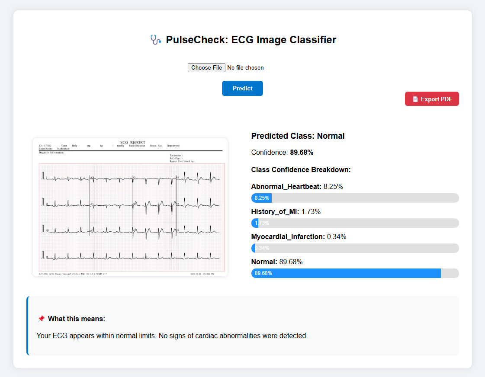

# 🫀 ECG Heartbeat Classification Using Convolutional Neural Networks

**A Deep Learning system capable of classifying ECG images into 4 diagnostic categories with 95.06% accuracy, featuring a custom CNN architecture and a real-time Django web interface.**


[](Project_Report.pdf)

---

## 👨‍🔬 Authors

- **Ahsan Rizvi**  
- **Umme Hani Roshni**  
- **Md. Irtiza Hossain Mahmud**
  
Department of Electrical and Computer Engineering, North South University

---

## 📄 Project Abstract

Cardiovascular diseases (CVDs) require fast and accurate diagnostics. This academic project automates the classification of **12-lead ECG images** into four classes:

1. **Normal**  
2. **Myocardial Infarction (MI)**  
3. **Abnormal Heartbeat**  
4. **History of MI**

We developed a **Custom Convolutional Neural Network (CNN)** that outperforms standard transfer learning models (ResNet50, MobileNetV2) on this dataset, achieving a **95.06% validation accuracy** with fewer parameters.

> **Key Result:** Our lightweight Custom CNN (423K parameters) achieved strong generalization compared to heavier transfer learning models for this task.

---

## 🏗️ System Architecture

The pipeline consists of six stages:

**Input → Preprocessing (CLAHE, Grayscale) → Augmentation (Albumentations) → CNN Training → Django Deployment → Output**



---

## 📊 Model Performance

Models were trained on a balanced, augmented dataset of **8,204 ECG images**.  
The **Custom CNN** achieved the best balance between accuracy and generalization.

| Model         | Accuracy | F1 Score | Parameters | Notes                  |
|---------------|----------|----------|------------|------------------------|
| **Custom CNN** | **95.06%** | **0.95** | **423K**     | Best overall balance   |
| ResNet50      | 96.16%   | 0.94     | 23.6M      | Signs of overfitting   |
| MobileNetV2   | 90.18%   | 0.90     | 2.4M       | Lower performance      |

### Confusion Matrix (Custom CNN)

The model distinguishes **Abnormal Heartbeat** and **Myocardial Infarction (MI)** with high accuracy.



---

## 💻 Web Deployment

The trained model was deployed using **Django** to create a real-time ECG diagnostic web application.



### Inference Logic

The web app applies the same preprocessing steps used during training.

```python
# Core prediction logic from views.py
def predict_image(request):
    img_array = cv2.imread(file_path, cv2.IMREAD_GRAYSCALE)
    new_array = cv2.resize(img_array, (384, 384))

    new_array = new_array.reshape(-1, 384, 384, 1)

    prediction = model.predict(new_array)
    class_index = np.argmax(prediction)
````

---

## 🚀 How to Run Locally

### 1. Prerequisites

* Python 3.8+
* TensorFlow
* Django

---

### 2. Installation

```bash
git clone https://github.com/ahsanrizvi99/automated-ecg-diagnosis.git
cd automated-ecg-diagnosis
pip install -r requirements.txt
```

---

### 3. Run the Web App

```bash
cd web_app
python manage.py runserver
```

Open your browser and visit:
👉 `http://127.0.0.1:8000/`

---

## 📂 Dataset Information

Dataset used: **ECG Images Dataset of Cardiac Patients**
DOI: `10.17632/gwbz3fsgp8.2`

### Preprocessing

* CLAHE enhancement
* Median filtering
* Grayscale conversion

### Augmentation

* Rotation
* Noise injection
* Brightness adjustment
  (Using **Albumentations**)

---

## 📄 License

This project is intended for **academic and educational purposes only**.

